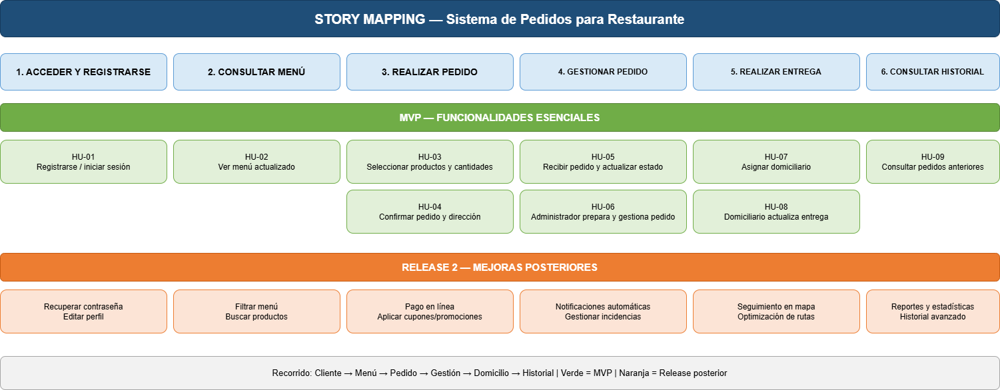

# 5. Story Mapping

El Story Mapping organiza el producto alrededor de cuatro áreas principales:

1. **Gestión de pedidos**
2. **Gestión de clientes**
3. **Gestión de entregas**
4. **Gestión del menú**

La figura original se conserva como evidencia visual.

