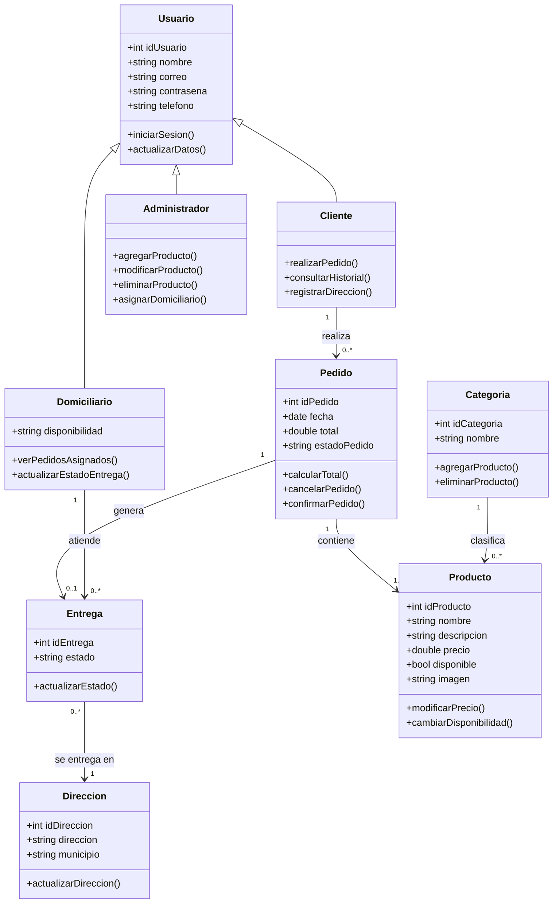

# 7. Diagrama de clases

El siguiente diagrama representa las principales clases identificadas en el entregable y sus relaciones. Se presenta directamente en formato Mermaid para que pueda visualizarse correctamente dentro de GitHub sin depender de una imagen externa.

## Interpretación general

- `Usuario` funciona como clase general de la cual se especializan `Cliente`, `Administrador` y `Domiciliario`.
- El `Cliente` realiza pedidos.
- Un `Pedido` contiene uno o varios productos y puede generar una entrega.
- El `Domiciliario` gestiona las entregas que le son asignadas.
- La `Entrega` se relaciona con una dirección de destino.
- Los `Productos` se organizan por categorías.

> Este diagrama corresponde a la estructura conceptual presentada en el Entregable 1. La versión en Mermaid permite visualizarlo directamente en GitHub de forma más estable.
