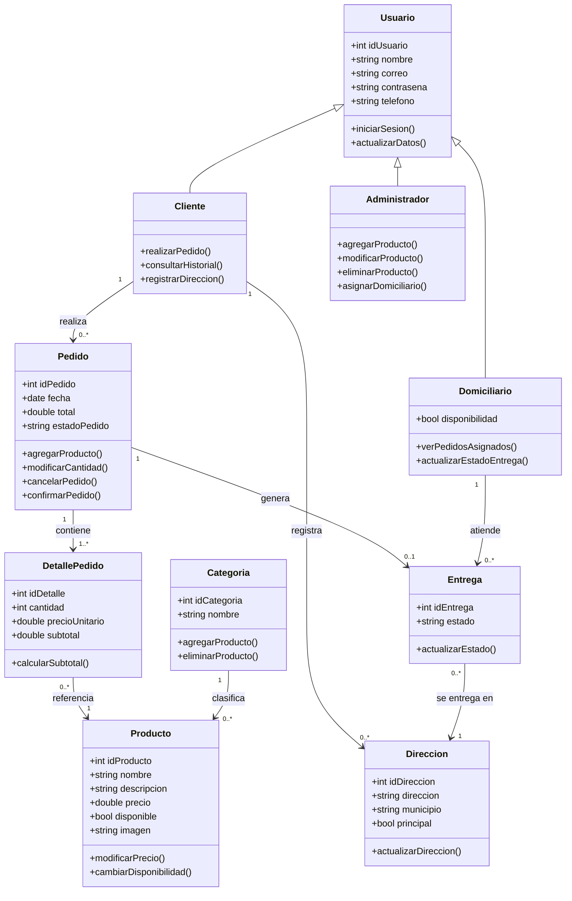

# 7. Diagrama de clases

El siguiente diagrama representa las principales clases identificadas y sus relaciones. Se presenta directamente en formato Mermaid

## Interpretación general

- `Usuario` funciona como clase general de la cual se especializan `Cliente`, `Administrador` y `Domiciliario`.
- El `Cliente` realiza pedidos y registra sus propias direcciones de entrega.
- Un `Pedido` está compuesto por uno o varios `DetallePedido`, cada uno con la cantidad y el subtotal de un producto específico. Esta clase intermedia evita relacionar `Pedido` y `Producto` directamente, ya que un mismo producto puede aparecer en muchos pedidos distintos.
- Un `Pedido` puede generar una `Entrega`.
- El `Domiciliario` gestiona las entregas que le son asignadas.
- La `Entrega` se relaciona con una dirección de destino, y esa dirección puede marcarse como principal.
- Los `Productos` se organizan por categorías.
