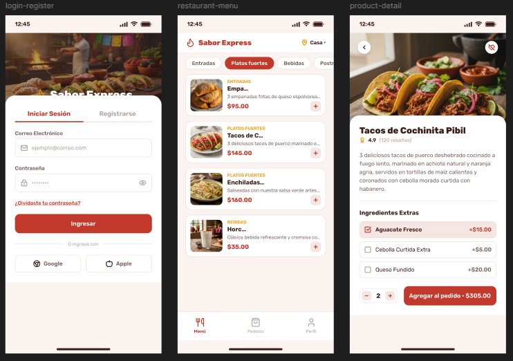
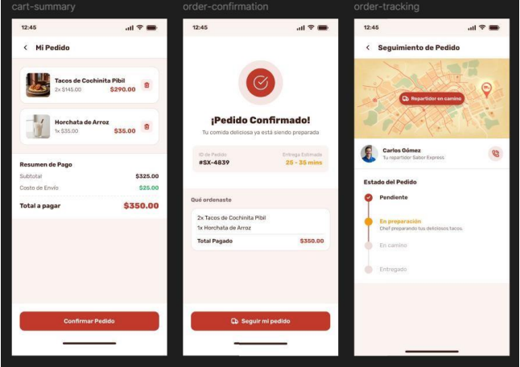
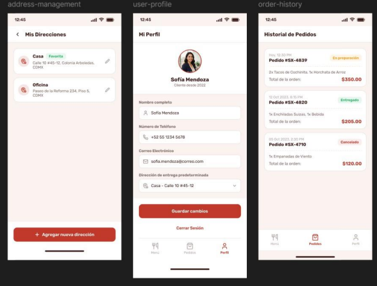
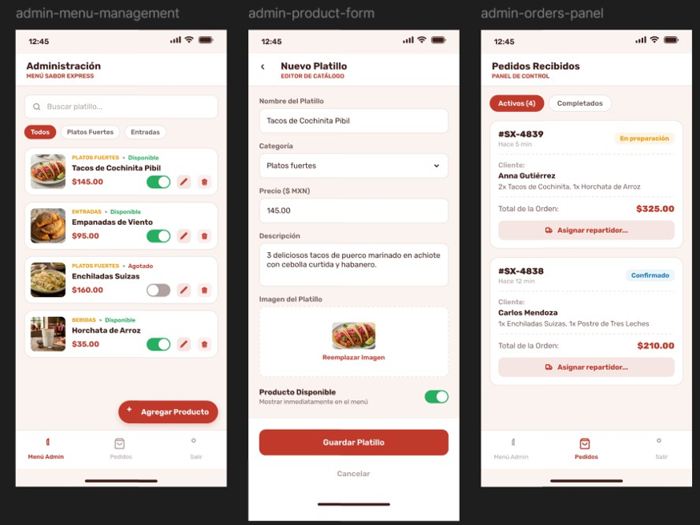
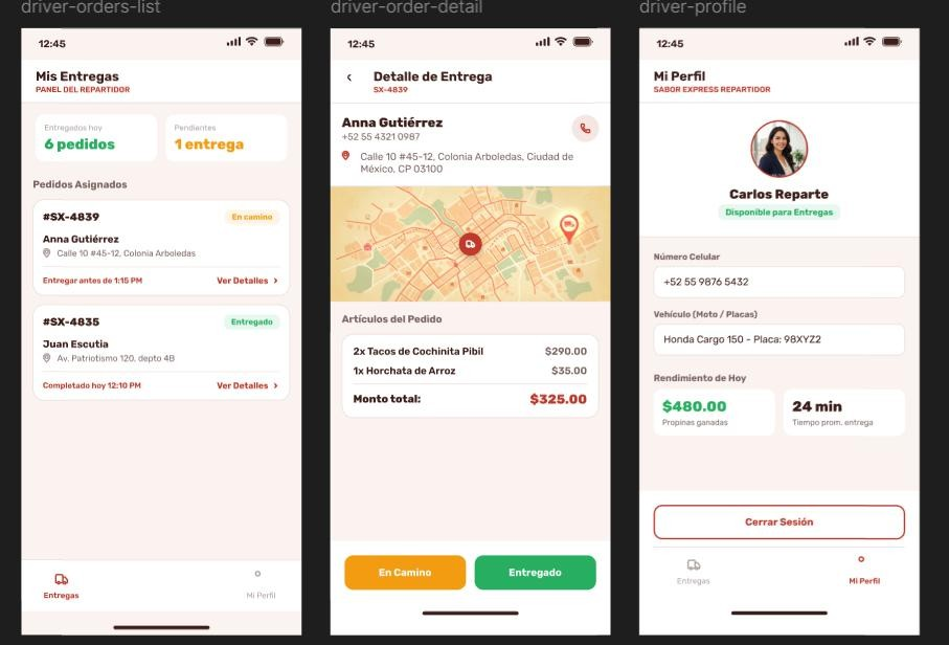

# 8. Prototipo de alta fidelidad — Figma

El prototipo contempla interfaces específicas para **cliente**, **administrador** y **domiciliario**.

## Cliente

### Inicio de sesión
Ingreso con correo y contraseña, recuperación de contraseña y opciones de registro.

### Menú
Productos organizados por categoría con nombre, precio e imagen.

### Detalle del producto
Descripción, calificación, ingredientes extra y opción para agregar al pedido.

### Resumen del pedido
Productos, cantidades, precios, subtotal, envío y total.

### Confirmación
ID del pedido y tiempo estimado de entrega.

### Seguimiento
Estado en tiempo real, mapa y datos del domiciliario asignado.

### Direcciones, perfil e historial
Gestión de direcciones, datos del usuario e historial de pedidos.

## Administrador

- Gestión del menú.
- Alta y edición de platillos.
- Activación/desactivación de disponibilidad.
- Eliminación de productos.
- Panel de pedidos.
- Asignación de domiciliarios.

## Domiciliario

- Lista de entregas asignadas.
- Detalle del pedido y dirección.
- Mapa.
- Actualización a “en camino” o “entregado”.
- Perfil y resumen de rendimiento.

> Link figma: https://www.figma.com/design/HQ0V1w7lX3dpqzc2LIPwgi/Untitled?node-id=0-1&t=qxSfaKM2h0ZR99G7-1
